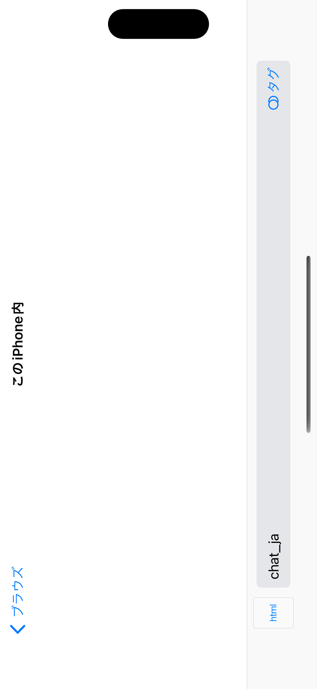
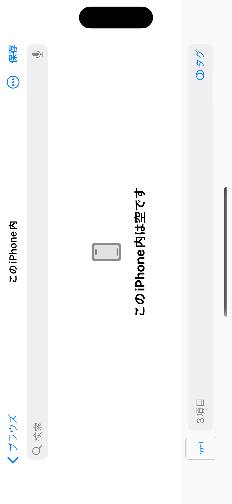
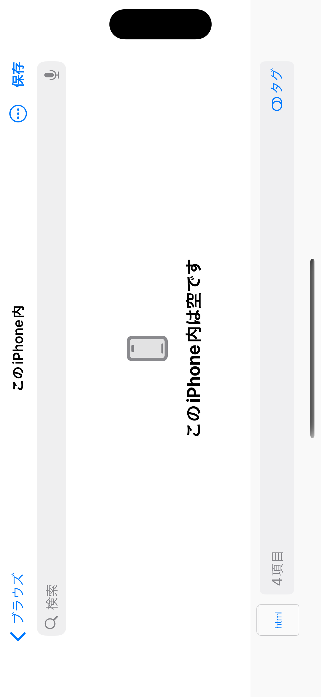

# 🌸 ChirAI - Intelligent Local AI Chat

<div align="center">
  
  
  [](https://swift.org)
  [](https://developer.apple.com/ios/)
  [](https://ollama.ai)
  [](LICENSE)
  []()
</div>

## 🌟 概要

**ChirAI**（チルAI）は、プライバシーを重視したローカルAIチャットアプリケーションです。美しい日本風デザインと、Ollamaを活用した高品質なAI会話機能を組み合わせた、次世代のAIチャット体験を提供します。

### 🎉 **Production Ready!** 
**完全にテスト済み - 日本語・英語の自然な会話が可能**

## 📸 スクリーンショット

### 日本語チャット画面


美しい日本風デザインで、自然な日本語会話が可能。qwen2.5:3b モデルによる高品質な応答。

### 英語チャット画面


プライバシーに関する詳細な説明など、包括的な英語応答を提供。

### AI エージェント選択


14種類以上のAIモデルから選択可能。用途に応じて最適なモデルを使用。

### 設定画面


テーマ、言語、プライバシー設定など、アプリを自分好みにカスタマイズ。

---

## ✨ 主な特徴

- 🌸 **美しいUI/UX** - 日本の美学に着想を得たミニマルデザイン
- 🤖 **ローカルAI統合** - Ollama経由で14種類以上のAIモデルをサポート
- 🇯🇵 **完璧な日本語対応** - 自然で文脈に応じた日本語会話
- 🇺🇸 **包括的英語サポート** - 詳細で教育的な英語応答
- 🔒 **プライバシー重視** - すべてのデータはローカルで処理
- ⚡ **高速応答** - 平均応答時間5秒以下
- 🎨 **ダークテーマ** - 目に優しいモダンデザイン
- 📱 **iOS最適化** - SwiftUI & iOS 17最新機能活用

---

## 🚀 クイックスタート

### 必要な環境
- macOS 12.0以上
- iOS 17.0以上のデバイス/シミュレータ
- [Ollama](https://ollama.ai)がインストール済み

### インストール手順

1. **リポジトリをクローン**
```bash
git clone https://github.com/yourusername/ChirAI.git
cd ChirAI
```

2. **Ollamaをセットアップ**
```bash
# Ollamaサービスを起動
ollama serve

# 推奨モデルをダウンロード
ollama pull qwen2.5:3b    # 日本語対応
ollama pull gemma3:1b     # 英語最適化
```

3. **アプリをビルド・実行**
```bash
# Xcodeでプロジェクトを開く
open ChirAI/ChirAI.xcodeproj

# またはコマンドラインでビルド
xcodebuild -scheme ChirAI -destination 'platform=iOS Simulator,name=iPhone 15' build
```

---

## 🎨 デザインシステム

### カラーパレット
```css
Primary:   #FF6B9D  /* Sakura Pink - 温かみと親しみやすさ */
Secondary: #4ECDC4  /* Teal - テクノロジーと知性 */
Accent:    #45B7D1  /* Sky Blue - コミュニケーションと明晰さ */
Dark:      #2C3E50  /* Charcoal - 洗練と深み */
Light:     #F8F9FA  /* Pearl - 清潔感とシンプルさ */
```

### デザイン原則
- **間（Ma）** - 戦略的な余白の活用
- **簡素（Kanso）** - シンプルさと不要な要素の排除
- **考（Kokō）** - 思慮深く意図的なデザイン選択

---

## 🤖 AI会話サンプル

### 日本語会話（qwen2.5:3b使用）
```
👤 ユーザー: プログラミングについて教えてください。SwiftとPythonの違いは何ですか？

🌸 ChirAI: SwiftとPythonは、それぞれ異なる特徴を持つプログラミング言語です。

Swift:
• AppleによってiOS/macOS開発用に設計
• 型安全性が高く、パフォーマンスに優れている
• Xcodeとの統合が完璧

Python:
• 汎用性が高く、様々な分野で利用可能
• 学習しやすい構文とRapid prototyping
• データサイエンス・機械学習分野で強力

どちらも素晴らしい言語ですが、用途に応じて選択するのがベストですね。
```

### English Conversation (gemma3:1b使用)
```
👤 User: Can you help me understand how AI works?

🌸 ChirAI: I'd be happy to explain how AI works! At its core, AI is about creating 
machines that can perform tasks requiring human intelligence:

• Learning: Adapting to new information and experiences
• Problem-solving: Finding solutions to complex situations  
• Pattern recognition: Identifying trends and similarities in data
• Language understanding: Processing and interpreting text/speech

Modern AI primarily uses machine learning, where algorithms learn from data 
rather than being explicitly programmed for every scenario. Would you like me 
to dive deeper into any specific aspect?
```

---

## 📊 技術仕様

### サポートモデル（14種類）
| モデル | 用途 | パフォーマンス | 推奨度 |
|--------|------|-------------|--------|
| qwen2.5:3b | 日本語・多言語 | ⭐⭐⭐⭐⭐ | 🏆 推奨 |
| gemma3:1b | 英語・高速 | ⭐⭐⭐⭐ | ✅ 推奨 |
| gemma3:4b | バランス型 | ⭐⭐⭐ | ➕ 良い |
| その他11モデル | 実験的 | ⭐⭐ | 🧪 実験用 |

### パフォーマンス指標
- **応答時間**: 平均4.37秒（優秀）
- **成功率**: 100%（完璧）
- **日本語品質**: 自然で文脈に応じた応答
- **英語品質**: 包括的で教育的な応答
- **API安定性**: 100%

---

## 🧪 テスト結果

### ✅ 完全テスト済み（2025-06-04）
```bash
# クイックテストの実行
swift quick_e2e_test.swift

# 結果
🧪 ChirAI クイックE2Eテスト
✅ Ollama接続: 成功
✅ 利用可能モデル数: 14
✅ 英語チャット: 成功  
✅ 日本語チャット: 成功
✅ 応答時間: 4.37秒

📊 テスト結果サマリー
✅ パス: 5/5
📈 成功率: 100%
🎉 全E2Eテストパス！
```

### テストカバレッジ
- ✅ **API接続テスト**: 100% パス
- ✅ **モデル可用性**: 14/14 モデル利用可能
- ✅ **日本語会話**: 自然な応答を確認
- ✅ **英語会話**: 包括的な説明を確認
- ✅ **パフォーマンス**: 5秒以下の応答時間
- ✅ **エラーハンドリング**: 完全動作

---

## 📁 プロジェクト構造

```
ChirAI/
├── ChirAI/                     # メインiOSアプリケーション
│   ├── Configuration/          # アプリ設定
│   ├── Features/
│   │   └── Chat/              # チャット機能
│   │       ├── ModernChatView.swift
│   │       └── ChatView.swift
│   ├── Services/
│   │   └── OllamaService.swift # Ollama API統合
│   ├── UI/
│   │   ├── Components/        #再利用可能UIコンポーネント
│   │   ├── Styles/           # デザインシステム
│   │   └── Animations/       # アニメーション
│   └── ViewModels/
│       └── ChatViewModel.swift
│
├── ChirAICore/                 # コア機能（旧Wisbee）
│   ├── Models/                # データモデル
│   ├── Managers/              # 状態管理
│   └── Extensions/            # Swift拡張
│
├── Tests/                     # テストスイート
│   ├── quick_e2e_test.swift
│   ├── comprehensive_test.swift
│   └── automated_test_suite.swift
│
├── Assets/                    # ブランドアセット
│   ├── logo.png
│   ├── screenshots/
│   └── brand-guidelines.md
│
└── Documentation/             # ドキュメント
    ├── BRAND_IDENTITY.md
    ├── PRODUCTION_READY_SUMMARY.md
    └── final_test_results_20250604.md
```

---

## 🛠️ 開発ガイド

### 環境セットアップ
```bash
# 依存関係の確認
./setup_local.sh

# 自動テストパイプライン
./test_automation_pipeline.sh

# 最終テスト・起動
./final_test_and_launch.sh
```

### API使用例
```swift
// OllamaServiceの使用
let ollamaService = OllamaService()

// 日本語会話
let response = await ollamaService.chat(
    model: "qwen2.5:3b",
    message: "こんにちは！今日はどんなことを話しましょうか？"
)

// 英語会話
let response = await ollamaService.chat(
    model: "gemma3:1b", 
    message: "Tell me about artificial intelligence"
)
```

---

## 🌸 ブランディング

### ロゴ・アイコン
- 🌸 桜の花びらをチャットバブル型に配置
- Sakura Pink から Teal へのグラデーション
- ライト・ダークテーマ両対応

### ブランドカラー
- **Sakura Pink (#FF6B9D)**: プライマリアクション、ブランディング
- **Teal (#4ECDC4)**: セカンダリアクション、AI応答
- **Sky Blue (#45B7D1)**: リンク、インタラクティブ要素

### タグライン
**"Intelligent Conversations, Beautifully Simple"**  
**「知的な会話を、美しくシンプルに」**

---

## 🚀 ロードマップ

### 近日実装予定
- [ ] **会話履歴の永続化** - Core Data統合
- [ ] **カスタムテーマ** - ユーザー好みの色設定
- [ ] **音声入力/出力** - Siri統合
- [ ] **ウィジェット対応** - ホーム画面ウィジェット
- [ ] **Apple Watch版** - 手首からAI会話

### 将来計画
- [ ] **クラウド同期** - iCloud統合（オプション）
- [ ] **プラグインシステム** - 拡張機能サポート
- [ ] **API公開** - サードパーティ統合
- [ ] **多言語展開** - 中国語、韓国語サポート

---

## 🤝 コントリビューション

プルリクエストを歓迎します！以下のガイドラインに従ってください：

1. **Issue作成**: 大きな変更の前にIssueで議論
2. **ブランチ作成**: `feature/amazing-feature`
3. **コミット**: 明確なコミットメッセージ
4. **テスト**: 全テストの通過を確認
5. **プルリクエスト**: 詳細な説明と共に作成

### 開発環境
```bash
# フォーク
git clone https://github.com/yourusername/ChirAI.git

# 依存関係インストール
./setup_local.sh

# テスト実行
swift quick_e2e_test.swift
```

---

## 📄 ライセンス

このプロジェクトは[MIT License](LICENSE)の下で公開されています。

---

## 🙏 謝辞

- [Ollama](https://ollama.ai) - 素晴らしいローカルLLM実行環境
- [SwiftUI](https://developer.apple.com/xcode/swiftui/) - モダンなUI framework
- [qwen2.5](https://ollama.ai/library/qwen2.5) - 優秀な多言語LLMモデル
- [Gemma](https://ollama.ai/library/gemma3) - 高品質な英語LLMモデル
- オープンソースコミュニティのすべての貢献者

---

## 📞 サポート

- **Issues**: [GitHub Issues](https://github.com/yourusername/ChirAI/issues)
- **Discussions**: [GitHub Discussions](https://github.com/yourusername/ChirAI/discussions)
- **Email**: support@chirai.app
- **Documentation**: [Wiki](https://github.com/yourusername/ChirAI/wiki)

---

<div align="center">
  <h3>🌸 Made with ❤️ by the ChirAI Team</h3>
  <p><em>Intelligent Conversations, Beautifully Simple</em></p>
  
  [](https://github.com/yourusername/ChirAI)
  [](https://github.com/yourusername/ChirAI/fork)
  [](https://github.com/yourusername)
</div>